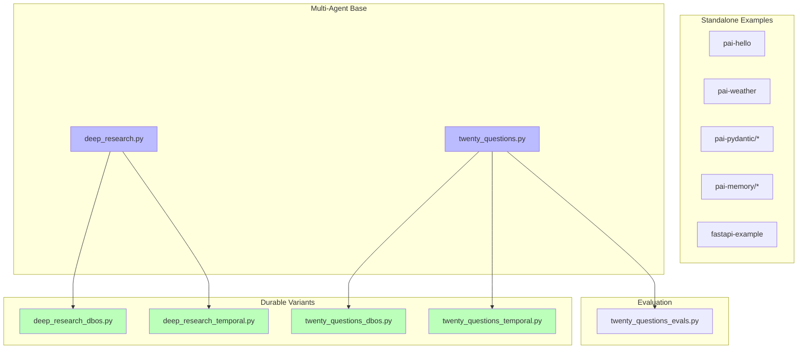

# Repository Architecture Documentation

## Overview

This repository is a comprehensive demonstration of the **Pydantic Stack**, showcasing how to build production-ready AI applications using:

- **Pydantic AI** - Type-safe AI agent framework with structured outputs and tool integration
- **Logfire** - Enterprise observability platform with distributed tracing
- **FastAPI** - Modern Python web framework for building APIs
- **Durable Execution** - Fault-tolerant workflows using DBOS and Temporal
- **Model Context Protocol (MCP)** - Standardized tool integration for AI agents

The codebase contains **10 distinct example applications** demonstrating progressively complex patterns, from basic "hello world" agents to multi-agent orchestration with durable execution. All examples emphasize type safety, observability, and production-ready patterns.

### Key Characteristics

- **Example-Driven**: Each module is a standalone, runnable demonstration
- **Type-Safe**: Heavy use of Pydantic models for validation and structured outputs
- **Observable**: Comprehensive Logfire instrumentation across all layers
- **Production-Ready**: Patterns for error handling, retry logic, and durable execution
- **Multi-Model**: Support for OpenAI, Anthropic, and Google Vertex AI

### Technology Stack at a Glance

| Layer | Technologies |
|-------|-------------|
| **AI Framework** | Pydantic AI v1.22+, Pydantic v2 |
| **Observability** | Logfire v4.10+ with OpenTelemetry |
| **Web** | FastAPI v0.115+, HTTPX AsyncClient |
| **LLM Providers** | OpenAI GPT-4/4.1, Anthropic Claude 3.5/4/4.5, Google Gemini 2.5 |
| **Durable Execution** | DBOS v2+, Temporal Workflows |
| **Data & Tools** | PostgreSQL (asyncpg), Tavily Search API |
| **Evaluation** | Pydantic Evals |

---

## Quick Start

### How to Navigate This Documentation

This documentation suite consists of five interconnected documents:

| Document | Purpose | When to Read |
|----------|---------|--------------|
| **README.md** (this file) | High-level overview and navigation guide | Start here |
| [01_component_inventory.md](docs/01_component_inventory.md) | Exhaustive catalog of all modules, classes, and functions | Reference when looking for specific components |
| [02_architecture_diagrams.md](diagrams/02_architecture_diagrams.md) | Visual system architecture and relationships | Understanding system structure |
| [03_data_flows.md](docs/03_data_flows.md) | Sequence diagrams showing how data moves through patterns | Understanding execution flows |
| [04_api_reference.md](docs/04_api_reference.md) | Detailed API documentation with examples | Implementation guide |

### Recommended Reading Order

**For Newcomers:**
1. Read this README for context
2. Review [02_architecture_diagrams.md](diagrams/02_architecture_diagrams.md) for visual overview
3. Check [03_data_flows.md](docs/03_data_flows.md) for key patterns
4. Use [04_api_reference.md](docs/04_api_reference.md) as implementation guide

**For Specific Tasks:**
- **Finding a component**: [01_component_inventory.md](docs/01_component_inventory.md)
- **Understanding architecture**: [02_architecture_diagrams.md](diagrams/02_architecture_diagrams.md)
- **Learning patterns**: [03_data_flows.md](docs/03_data_flows.md)
- **API details**: [04_api_reference.md](docs/04_api_reference.md)

---

## Architecture Summary

### System Layers

The architecture follows a clear layered design with separation of concerns:

```
┌─────────────────────────────────────────────────┐
│   Application Layer (10 Example Modules)       │
│   - pai-hello, pai-weather, pai-pydantic       │
│   - pai-memory, pai-mcp-sampling               │
│   - fastapi-example, distributed-frontend      │
│   - durable-exec (deep_research, 20_questions) │
└─────────────────────────────────────────────────┘
                      ↓
┌─────────────────────────────────────────────────┐
│   Agent Framework Layer                         │
│   - Pydantic AI Core (Agent, RunContext)       │
│   - Tool System (@agent.tool decorators)       │
│   - Model Adapters (OpenAI, Anthropic, Gemini) │
│   - Durable Wrappers (DBOSAgent, TemporalAgent)│
└─────────────────────────────────────────────────┘
                      ↓
┌─────────────────────────────────────────────────┐
│   Integration Layer                             │
│   - LLM Providers (OpenAI, Anthropic, Vertex)  │
│   - External Services (Tavily Search, APIs)    │
│   - Durable Backends (DBOS, Temporal)          │
│   - Database (PostgreSQL via asyncpg)          │
└─────────────────────────────────────────────────┘
                      ↓
┌─────────────────────────────────────────────────┐
│   Observability Layer (Cross-Cutting)           │
│   - Logfire instrumentation                    │
│   - Distributed tracing (OpenTelemetry)        │
│   - Structured logging                         │
└─────────────────────────────────────────────────┘
```

### Key Design Patterns

The codebase demonstrates seven core patterns:

| Pattern | Description | Example Modules |
|---------|-------------|-----------------|
| **Simple Agent** | Basic agent with single-turn interaction | pai-hello |
| **Tool-Based Agent** | Agent with custom tools and dependency injection | pai-weather, pai-memory/with_tools |
| **Structured Output** | Type-safe responses using Pydantic models | pai-pydantic/simple, pai-pydantic/retry |
| **Memory Pattern** | Persistent conversation state (DB or message history) | pai-memory/with_messages, pai-memory/with_tools |
| **Multi-Agent** | Multiple specialized agents collaborating | durable-exec/deep_research, twenty_questions |
| **Durable Execution** | Fault-tolerant workflows with checkpointing | *_dbos.py, *_temporal.py variants |
| **MCP Integration** | External tool servers via Model Context Protocol | pai-mcp-sampling |

### Architecture Principles

1. **Type Safety First**: All data structures use Pydantic models for validation
2. **Dependency Injection**: Tools receive context via `RunContext[Deps]`
3. **Async-First**: Most implementations use async/await for I/O
4. **Instrumentation Everywhere**: Logfire tracks all major operations
5. **Composability**: Agents are designed to be composed into workflows
6. **Error Resilience**: Retry logic, validation, and usage limits built-in

---

## Component Overview

### Organized by Functional Area

#### 1. Core Examples (Getting Started)

**logfire-hello-world**
- Minimal Logfire structured logging example
- Entry point: `logfire-hello-world/main.py`

**pai-hello**
- Simplest Pydantic AI agent (synchronous)
- Entry point: `pai-hello/main.py`

#### 2. Agent Patterns

**pai-weather** - Multi-tool agent with dependency injection
- Two async tools: `get_lat_lng()`, `get_weather()`
- Demonstrates HTTP client injection via `Deps` dataclass
- Entry point: `pai-weather/main.py:79`

**pai-pydantic** - Structured output extraction
- `simple.py`: Basic Pydantic model extraction
- `retry.py`: Field validation with automatic retry
- Entry points: Lines 22-23 in each file

#### 3. Memory & Persistence

**pai-memory/with_messages** - Database-backed message history
- PostgreSQL storage of conversation context
- `run_agent()` function at line 51

**pai-memory/with_tools** - Tool-based memory system
- `record_memory()` and `retrieve_memories()` tools
- Agent uses tools autonomously to remember information

#### 4. Web Services

**fastapi-example** - Basic FastAPI with image generation
- POST `/generate` endpoint for DALL-E image creation
- Logfire instrumentation of FastAPI and HTTPX

**distributed-frontend-example** - Distributed tracing
- CORS middleware for frontend integration
- POST `/client-traces` proxy endpoint for browser telemetry
- Demonstrates end-to-end tracing from browser to backend

#### 5. Multi-Agent Workflows

**durable-exec/deep_research.py** - Three-agent research workflow
- `plan_agent`: Creates research plan (Claude Sonnet 4.5)
- `search_agent`: Executes parallel web searches (Gemini 2.5 Flash)
- `analysis_agent`: Synthesizes results (Claude Sonnet 4.5)
- Entry point: `deep_research()` function at line 72

**durable-exec/twenty_questions.py** - Interactive agent game
- `questioner_agent`: Asks strategic questions (GPT-4.1)
- `answerer_agent`: Responds truthfully (Claude Haiku)
- `ask_question` tool enables agent-to-agent communication
- Entry point: `play()` function at line 65

#### 6. Durable Execution Variants

**DBOS Variants** (`*_dbos.py`)
- `DBOSAgent` wrapper for automatic checkpointing
- PostgreSQL-backed state persistence
- Workflow resumption by ID

**Temporal Variants** (`*_temporal.py`)
- `TemporalAgent` wrapper for distributed workflows
- Activity-based execution model
- Simulated failure/recovery demonstrations

#### 7. MCP Integration

**pai-mcp-sampling/client.py** - MCP client
- Connects to MCP server via stdio
- Enables sampling (LLM calls proxied through client)

**pai-mcp-sampling/generate_svg.py** - MCP server
- FastMCP-based tool server
- `image_generator` tool using agent sampling

#### 8. Evaluation

**durable-exec/twenty_questions_evals.py** - Model evaluation
- Tests multiple AI models on same dataset
- Custom evaluators: `QuestionCount`, `QnASuccess`
- Compares GPT-4, Claude, and Gemini models

### Component Relationships



---

## Key Data Flows

### Primary Use Cases

#### 1. Simple Query Flow
**Use Case**: One-shot question answering

```
User → Agent → LLM → Agent → User
```

**Example**: pai-hello, pai-pydantic/simple

**Key Points**:
- Synchronous or async execution
- Single request-response cycle
- Structured output via Pydantic models

#### 2. Tool Permission Callback Flow
**Use Case**: Agent needs external data or capabilities

```
User → Agent → LLM (requests tool)
       ↓
    Tool Function (with context)
       ↓
    External API/Database
       ↓
    LLM (with results) → Final Answer
```

**Example**: pai-weather (gets coordinates, then weather)

**Key Points**:
- Tools registered with `@agent.tool` decorator
- Dependencies injected via `RunContext[Deps]`
- Multiple tool calls in single conversation

#### 3. Interactive Session Flow
**Use Case**: Multi-turn conversations with memory

```
User → run_agent() → DB (retrieve history)
                  → Agent (with history)
                  → LLM → Response
                  → DB (store new messages)
```

**Example**: pai-memory/with_messages

**Key Points**:
- Message history stored in PostgreSQL
- Each turn adds to conversation context
- User isolation via `user_id`

#### 4. Multi-Agent Orchestration
**Use Case**: Complex task requiring specialized agents

```
User → Orchestrator
       ├─→ Plan Agent (creates strategy)
       ├─→ Parallel Search Agents (gather data)
       └─→ Analysis Agent (synthesizes)
              ├─→ Optional: extra_search tool
              └─→ Final Report
```

**Example**: durable-exec/deep_research

**Key Points**:
- Different models for different tasks
- Parallel execution with `asyncio.TaskGroup`
- Cross-agent tool calls (agent as dependency)

### Critical Paths Through the System

1. **Type Validation Path**: User input → Pydantic validation → Retry on error → Success
2. **Error Recovery Path**: API failure → Log to Logfire → Retry logic → Alternative approach
3. **Durable Execution Path**: Workflow start → Checkpoint → Failure → Auto-resume → Complete

---

## API Highlights

### Most Commonly Used Classes

#### Agent
The core abstraction for AI interactions.

```python
from pydantic_ai import Agent

agent = Agent(
    'openai:gpt-4o',                    # Model identifier
    instructions='Be concise.',         # System prompt
    deps_type=MyDeps,                   # Optional dependency type
    output_type=MyModel,                # Optional structured output
    retries=2,                          # Retry on validation errors
)
```

**Key Methods**:
- `run_sync(prompt: str) -> AgentRunResult` - Synchronous execution
- `run(prompt: str, deps=..., message_history=...) -> AgentRunResult` - Async execution
- `tool(func)` - Decorator to register tool functions

#### RunContext[Deps]
Provides tools with access to dependencies and run metadata.

```python
from pydantic_ai import RunContext

@agent.tool
async def my_tool(ctx: RunContext[Deps], param: str) -> str:
    # Access dependencies
    client = ctx.deps.http_client

    # Access run metadata
    messages = ctx.messages

    return result
```

#### DBOSAgent / TemporalAgent
Wrappers for durable execution.

```python
from pydantic_ai.durable_exec.dbos import DBOSAgent
from pydantic_ai.durable_exec.temporal import TemporalAgent

# DBOS variant
dbos_agent = DBOSAgent(agent)

@DBOS.workflow()
async def my_workflow(data: str) -> str:
    result = await dbos_agent.run(data)
    return result.output

# Temporal variant
temporal_agent = TemporalAgent(agent)
```

### Quick Reference for Common Tasks

#### Extract Structured Data
```python
class Person(BaseModel):
    name: str
    age: int

agent = Agent('openai:gpt-4o', output_type=Person)
result = agent.run_sync("John is 30 years old")
person: Person = result.output  # Typed!
```

#### Add Custom Tools
```python
@dataclass
class Deps:
    api_key: str

@agent.tool
async def search(ctx: RunContext[Deps], query: str) -> str:
    return await external_search(query, ctx.deps.api_key)
```

#### Persist Conversation
```python
# Retrieve history
messages = await get_messages(user_id)

# Run with history
result = await agent.run(prompt, message_history=messages)

# Store new messages
await save_messages(user_id, result.new_messages())
```

### Configuration Essentials

**Environment Variables**:
```bash
# Required for AI providers (at least one)
OPENAI_API_KEY=sk-...
ANTHROPIC_API_KEY=sk-ant-...
GOOGLE_API_KEY=...

# Optional but recommended
LOGFIRE_TOKEN=...
TAVILY_API_KEY=...  # For web search

# Required for memory examples
DATABASE_URL=postgresql://postgres@localhost:5432
```

**Logfire Setup**:
```python
import logfire

# Configure once at startup
logfire.configure(service_name='my-app')

# Instrument libraries
logfire.instrument_pydantic_ai()
logfire.instrument_httpx(http_client)
logfire.instrument_asyncpg()
```

---

## Project Statistics

### Repository Metrics

| Metric | Count |
|--------|-------|
| **Example Modules** | 10 distinct applications |
| **Total Python Files** | 18 main modules |
| **Top-Level Directories** | 7 functional areas |
| **Agent Patterns** | 7 core patterns demonstrated |
| **Data Models** | 15+ Pydantic models |
| **Tool Functions** | 10+ registered agent tools |
| **FastAPI Endpoints** | 6 total endpoints (2 apps) |

### Module Breakdown

| Category | Count | Examples |
|----------|-------|----------|
| Basic Examples | 3 | logfire-hello-world, pai-hello, fastapi-example |
| Agent Patterns | 3 | pai-weather, pai-pydantic, pai-memory |
| Multi-Agent | 2 | deep_research, twenty_questions |
| Durable Variants | 4 | *_dbos.py, *_temporal.py |
| MCP Integration | 2 | client.py, generate_svg.py |
| Evaluation | 1 | twenty_questions_evals.py |
| Web Services | 2 | fastapi-example, distributed-frontend |

### Technology Coverage

**AI Models Used**:
- OpenAI: GPT-4o, GPT-4.1, GPT-4.1-mini
- Anthropic: Claude 3.5 Haiku, Claude Sonnet 4.0, Claude Sonnet 4.5
- Google: Gemini 2.5 Flash

**Integration Points**:
- 3 LLM providers (OpenAI, Anthropic, Google)
- 2 durable execution backends (DBOS, Temporal)
- 1 web search provider (Tavily)
- 1 database system (PostgreSQL)
- 1 observability platform (Logfire)

---

## Getting Started for Developers

### Development Environment Setup

1. **Prerequisites**:
   - Python 3.12 or higher
   - PostgreSQL (for memory/durable examples)
   - API keys for desired providers

2. **Installation**:
   ```bash
   # Clone repository
   git clone <repo-url>
   cd pydantic-stack-demo

   # Create virtual environment
   python -m venv .venv
   source .venv/bin/activate  # or .venv\Scripts\activate on Windows

   # Install dependencies
   pip install -e .

   # Install development dependencies
   pip install -e ".[dev]"
   ```

3. **Configuration**:
   ```bash
   # Set API keys
   export OPENAI_API_KEY="sk-..."
   export ANTHROPIC_API_KEY="sk-ant-..."
   export LOGFIRE_TOKEN="..."  # Optional

   # Start PostgreSQL (for memory examples)
   # Ensure PostgreSQL is running on localhost:5432
   ```

### Key Files to Understand First

**Start Here** (in order):

1. `pai-hello/main.py`
   - Simplest agent example (12 lines)
   - Understand: Agent creation, run_sync()

2. `pai-pydantic/simple.py`
   - Structured output extraction
   - Understand: output_type, Pydantic models

3. `pai-weather/main.py`
   - Tools and dependency injection
   - Understand: @agent.tool, RunContext[Deps]

4. `pai-memory/with_messages.py`
   - Conversational memory
   - Understand: message_history, database persistence

5. `durable-exec/deep_research.py`
   - Multi-agent orchestration
   - Understand: Agent composition, asyncio.TaskGroup

**Then Explore**:
- Durable execution variants (*_dbos.py, *_temporal.py)
- MCP integration (pai-mcp-sampling/)
- Web services (fastapi-example/, distributed-frontend-example/)

### Common Development Tasks

#### Run an Example
```bash
# Basic agent
python pai-hello/main.py

# Weather agent
python pai-weather/main.py

# Multi-agent workflow
python durable-exec/deep_research.py
```

#### Test with Different Models
```python
# In any agent example, change model:
agent = Agent('openai:gpt-4.1-mini')     # Fast & cheap
agent = Agent('anthropic:claude-sonnet-4-5')  # Smart & capable
agent = Agent('google-vertex:gemini-2.5-flash')  # Alternative
```

#### Add a New Tool
```python
@agent.tool
async def my_custom_tool(ctx: RunContext[Deps], param: str) -> str:
    """Tool description visible to LLM."""
    # Your implementation
    return result
```

#### Run Evaluations
```bash
python durable-exec/twenty_questions_evals.py
```

#### Start Web Services
```bash
# Basic FastAPI
python fastapi-example/main.py

# Distributed tracing example
export LOGFIRE_TOKEN="..."
export LOGFIRE_BASE_URL="https://logfire-api.pydantic.dev/"
python distributed-frontend-example/main.py
```

### Development Tools

**Linting & Formatting**:
```bash
ruff check .
ruff format .
```

**Type Checking**:
```bash
basedpyright
```

**Watch Logs**:
- Visit https://logfire.pydantic.dev after configuring LOGFIRE_TOKEN
- View traces, spans, and logs in real-time

---

## References

### Detailed Documentation

| Document | Description | Link |
|----------|-------------|------|
| **Component Inventory** | Complete catalog of modules, classes, and functions | [01_component_inventory.md](docs/01_component_inventory.md) |
| **Architecture Diagrams** | Visual system architecture with Mermaid diagrams | [02_architecture_diagrams.md](diagrams/02_architecture_diagrams.md) |
| **Data Flows** | Sequence diagrams showing execution patterns | [03_data_flows.md](docs/03_data_flows.md) |
| **API Reference** | Detailed API documentation with examples | [04_api_reference.md](docs/04_api_reference.md) |

### External Resources

- **Pydantic AI**: https://ai.pydantic.dev
- **Logfire**: https://docs.pydantic.dev/logfire
- **FastAPI**: https://fastapi.tiangolo.com
- **DBOS**: https://docs.dbos.dev
- **Temporal**: https://docs.temporal.io
- **Model Context Protocol**: https://modelcontextprotocol.io

### Key Source Files by Pattern

| Pattern | Primary Source File |
|---------|-------------------|
| Basic Agent | `pai-hello/main.py` |
| Structured Output | `pai-pydantic/simple.py` |
| Validation & Retry | `pai-pydantic/retry.py` |
| Tools & Dependencies | `pai-weather/main.py` |
| Message History | `pai-memory/with_messages.py` |
| Tool-Based Memory | `pai-memory/with_tools.py` |
| Multi-Agent | `durable-exec/deep_research.py` |
| Agent Interaction | `durable-exec/twenty_questions.py` |
| DBOS Durable | `durable-exec/deep_research_dbos.py` |
| Temporal Durable | `durable-exec/deep_research_temporal.py` |
| MCP Client | `pai-mcp-sampling/client.py` |
| MCP Server | `pai-mcp-sampling/generate_svg.py` |
| Web API | `fastapi-example/main.py` |
| Distributed Tracing | `distributed-frontend-example/main.py` |
| Model Evaluation | `durable-exec/twenty_questions_evals.py` |

---

## Document Generation Info

**Generated**: November 28, 2025

**Method**: Automated architecture analysis using Claude Code Agent SDK

**Source Documents**:
1. Component Inventory - Comprehensive module/class/function catalog
2. Architecture Diagrams - Visual system structure with Mermaid
3. Data Flows - Sequence diagrams for key patterns
4. API Reference - Detailed API documentation

**Analysis Coverage**:
- 18 Python modules analyzed
- 7 top-level directories
- 15+ data models documented
- 10+ tool functions catalogued
- 6 API endpoints described
- 7 core patterns identified

**Repository State**:
- Branch: main
- Commit: 7fb0723 (use gateway in temporal example, uprev pydantic-ai)

**Documentation Standards**:
- All file paths are absolute
- Line numbers reference source code locations
- Examples are executable code snippets
- Cross-references link to detailed documents

---

## Next Steps

**New to the Codebase?**
1. Read this README completely
2. Run `pai-hello/main.py` to verify setup
3. Review [Architecture Diagrams](diagrams/02_architecture_diagrams.md) for visual overview
4. Try examples in order of complexity (hello → weather → memory → multi-agent)

**Building Your Own Application?**
1. Start with [API Reference](docs/04_api_reference.md) for detailed usage
2. Review [Data Flows](docs/03_data_flows.md) for your pattern
3. Copy relevant example as template
4. Add Logfire instrumentation from day one

**Contributing or Deep Diving?**
1. Check [Component Inventory](docs/01_component_inventory.md) for complete catalog
2. Use [Architecture Diagrams](diagrams/02_architecture_diagrams.md) to understand relationships
3. Study [Data Flows](docs/03_data_flows.md) for execution patterns
4. Follow best practices in [API Reference](docs/04_api_reference.md)

**Need Help?**
- Check the detailed documentation linked above
- Review source code comments
- Visit external documentation links
- Examine Logfire traces for runtime behavior

This repository represents production-ready patterns for building AI applications with type safety, observability, and fault tolerance. Each example is designed to be understood, modified, and adapted to your specific use case.
