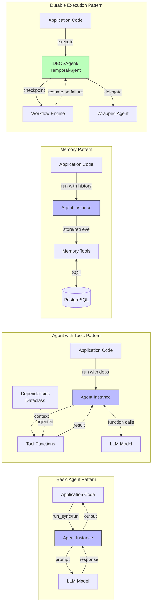
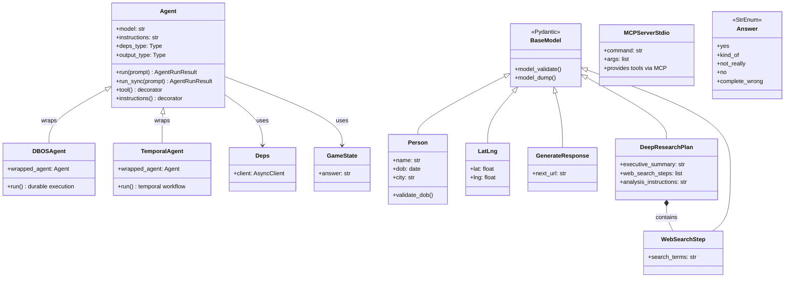
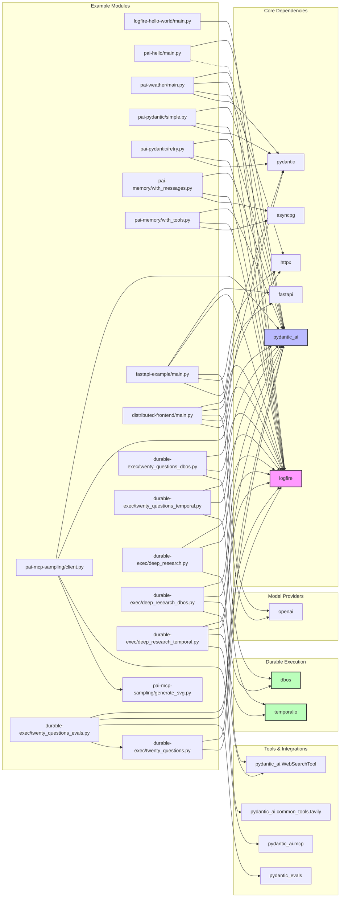
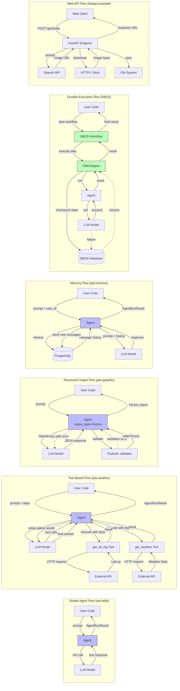
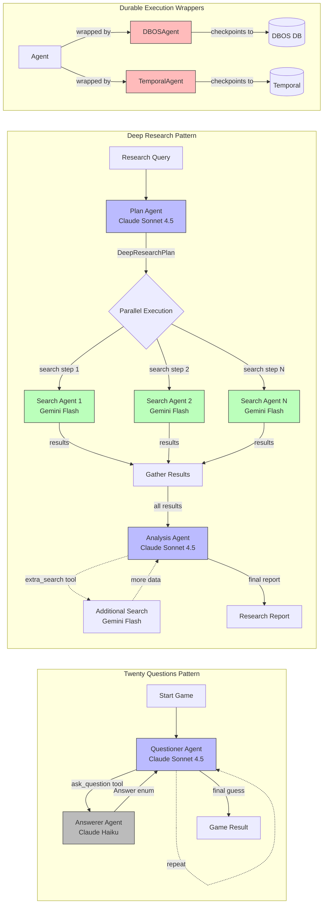
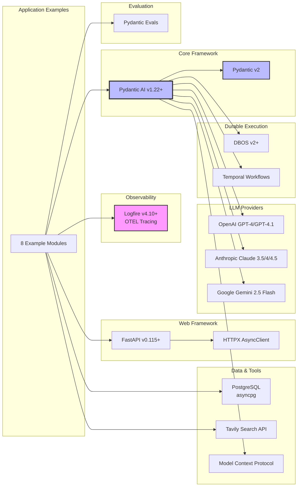

# Architecture Diagrams

## Overview

This codebase demonstrates the Pydantic AI stack through multiple example applications. The architecture is organized into distinct example modules that showcase different capabilities:

- **Pydantic AI Examples**: Core AI agent patterns and integrations
- **Durable Execution Examples**: Agent workflows with DBOS and Temporal
- **API/Frontend Examples**: FastAPI web services with observability
- **Integration Examples**: MCP (Model Context Protocol) and memory patterns

The architecture leverages a layered approach with:
- **Observability Layer**: Logfire for distributed tracing and monitoring
- **Agent Layer**: Pydantic AI agents with tools and structured outputs
- **Integration Layer**: External services (OpenAI, Anthropic, Tavily, PostgreSQL)
- **Execution Layer**: Synchronous, asynchronous, and durable execution patterns

## System Architecture

The system follows a layered architecture with clear separation of concerns. Each example application demonstrates different capabilities while sharing common infrastructure patterns.

```mermaid
graph TB
    subgraph "Observability Layer"
        LF[Logfire]
        LF_OTEL[OTEL/Distributed Tracing]
    end

    subgraph "Application Layer"
        PAI_HELLO[pai-hello<br/>Basic Agent]
        PAI_WEATHER[pai-weather<br/>Tools & Dependencies]
        PAI_PYDANTIC[pai-pydantic<br/>Structured Output]
        PAI_MEMORY[pai-memory<br/>Message History]
        PAI_MCP[pai-mcp-sampling<br/>MCP Integration]
        FASTAPI_EX[fastapi-example<br/>Web Service]
        DIST_FRONT[distributed-frontend<br/>CORS & Proxy]
        DURABLE[durable-exec<br/>Workflows]
    end

    subgraph "Agent Framework Layer"
        PAI[Pydantic AI Core]
        PAI_TOOLS[Agent Tools]
        PAI_MODELS[Model Adapters]
        PAI_DURABLE[Durable Exec<br/>DBOS/Temporal]
        PAI_MCP_CORE[MCP Protocol]
    end

    subgraph "External Services"
        OPENAI[OpenAI<br/>GPT-4]
        ANTHROPIC[Anthropic<br/>Claude]
        GEMINI[Google Vertex<br/>Gemini]
        TAVILY[Tavily<br/>Web Search]
        POSTGRES[PostgreSQL<br/>State/Memory]
    end

    subgraph "Durable Execution Backends"
        DBOS_SVC[DBOS<br/>Workflow Engine]
        TEMPORAL_SVC[Temporal<br/>Workflow Engine]
    end

    %% Application to Framework
    PAI_HELLO --> PAI
    PAI_WEATHER --> PAI
    PAI_WEATHER --> PAI_TOOLS
    PAI_PYDANTIC --> PAI
    PAI_MEMORY --> PAI
    PAI_MEMORY --> POSTGRES
    PAI_MCP --> PAI_MCP_CORE
    FASTAPI_EX --> OPENAI
    DIST_FRONT --> OPENAI
    DURABLE --> PAI_DURABLE

    %% Framework to Services
    PAI_MODELS --> OPENAI
    PAI_MODELS --> ANTHROPIC
    PAI_MODELS --> GEMINI
    PAI_TOOLS --> TAVILY
    PAI_DURABLE --> DBOS_SVC
    PAI_DURABLE --> TEMPORAL_SVC

    %% Observability
    PAI --> LF
    PAI_HELLO --> LF
    PAI_WEATHER --> LF
    PAI_PYDANTIC --> LF
    PAI_MEMORY --> LF
    PAI_MCP --> LF
    FASTAPI_EX --> LF
    DIST_FRONT --> LF_OTEL
    DURABLE --> LF

    style LF fill:#f9f,stroke:#333,stroke-width:2px
    style PAI fill:#bbf,stroke:#333,stroke-width:2px
    style DURABLE fill:#bfb,stroke:#333,stroke-width:2px
```

## Component Relationships

The components interact through well-defined patterns:

1. **Agent-Based Pattern**: Most examples use Pydantic AI Agent as the central component
2. **Dependency Injection**: Agents receive typed dependencies (Deps) for tools
3. **Instrumentation**: Logfire instruments all major components for observability
4. **Async First**: Most implementations use async/await patterns
5. **Type Safety**: Heavy use of Pydantic models for structured data

## Class Hierarchies

The codebase demonstrates extensive use of Pydantic models for data validation and structured outputs.

## Module Dependencies

This diagram shows the import relationships between main modules and their external dependencies.

## Data Flow

This diagram illustrates how data flows through different architectural patterns in the codebase.

## Multi-Agent Orchestration Patterns

The durable-exec examples demonstrate sophisticated multi-agent patterns.

## Technology Stack Summary

## Legend

### Arrow Types
- `-->` Solid arrow: Direct dependency or data flow
- `-.->` Dashed arrow: Optional/conditional flow or error handling
- `==>` Thick arrow: Primary/critical path

### Node Colors
- Blue: Agent/AI components
- Pink: Observability/monitoring
- Green: Durable execution/workflows
- Grey: Support components
- Red: Wrapper/decorator patterns

### Key Patterns
1. **Agent Pattern**: Core abstraction for LLM interactions
2. **Tool Pattern**: Extend agent capabilities with custom functions
3. **Structured Output**: Type-safe LLM responses via Pydantic
4. **Memory Pattern**: Persistent conversation state
5. **Durable Execution**: Fault-tolerant workflows with checkpointing
6. **Multi-Agent**: Orchestration of multiple specialized agents
7. **Observability**: Comprehensive tracing with Logfire
