# Data Flow Analysis

## Overview

This codebase demonstrates various data flow patterns using the Pydantic AI framework. The main patterns include:

1. **Simple Query Flow** - Basic synchronous/asynchronous agent requests with single-turn interactions
2. **Interactive Session Flow** - Multi-turn conversations with message history persistence
3. **Tool Permission Callback Flow** - Agent-initiated tool calls with dependency injection
4. **MCP Server Communication Flow** - Model Context Protocol interactions between client and server agents
5. **Message Parsing and Routing** - Structured output validation and retry logic
6. **Error Handling Flow** - Validation errors, retries, and usage limit management

## 1. Simple Query Flow

The simplest data flow pattern involves a single request-response interaction between the user and an LLM through a Pydantic AI agent. This pattern is demonstrated in the basic "hello world" examples.

### Key Components

- **Agent**: Core orchestrator that manages the request lifecycle
- **LLM Provider**: External model service (OpenAI, Anthropic, Gemini, etc.)
- **AgentRunResult**: Container for the response, messages, and metadata
- **Logfire**: Observability layer for tracking requests and performance

### Code References

**File**: `pai-hello/main.py`
- Lines 7-10: Agent initialization with model and system prompt
- Line 12: Synchronous execution with `agent.run_sync()`
- Line 13: Output extraction from `result.output`

**File**: `pai-pydantic/simple.py`
- Lines 17-21: Agent with structured output type
- Line 22: Synchronous run with natural language input
- Line 23: Logfire instrumentation for observability

## 2. Interactive Session Flow

This pattern handles multi-turn conversations where message history is persisted and retrieved across sessions. The system maintains conversational context through database storage.

### Key Components

- **ModelMessage**: Pydantic AI's message format for storing conversation history
- **ModelMessagesTypeAdapter**: Serializes/deserializes messages to/from JSON
- **Database Connection**: PostgreSQL connection for persistent storage
- **message_history parameter**: Passes historical context to the agent
- **new_messages_json()**: Extracts only new messages from the current run

### Code References

**File**: `pai-memory/with_messages.py`
- Lines 26-41: Database context manager with table creation
- Lines 50-63: `run_agent()` function orchestrating the flow
- Lines 54-56: Retrieving and deserializing message history
- Line 58: Running agent with `message_history` parameter
- Lines 61-63: Persisting new messages to database
- Lines 66-69: Example multi-turn conversation

## 3. Tool Permission Callback Flow

This pattern demonstrates how agents invoke tools with dependency injection and context management. Tools can access shared dependencies and make external API calls or database operations.

```mermaid
sequenceDiagram
    participant User
    participant Agent as Agent<br/>(weather_agent)
    participant ToolRegistry as Tool Registry
    participant GetLatLng as get_lat_lng()<br/>tool
    participant GetWeather as get_weather()<br/>tool
    participant HTTPClient as AsyncClient
    participant API as External API
    participant LLM

    User->>Agent: run("Weather in London?", deps=Deps(client))
    activate Agent

    Agent->>LLM: Send prompt + tool schemas
    activate LLM
    LLM-->>Agent: ToolCall(get_lat_lng, "London")
    deactivate LLM

    Agent->>ToolRegistry: Lookup tool by name
    ToolRegistry-->>Agent: get_lat_lng function

    Agent->>GetLatLng: invoke(ctx=RunContext(deps), "London")
    activate GetLatLng
    GetLatLng->>GetLatLng: Access ctx.deps.client
    GetLatLng->>HTTPClient: GET /latlng?location=London
    activate HTTPClient
    HTTPClient->>API: HTTP Request
    API-->>HTTPClient: JSON response
    HTTPClient-->>GetLatLng: Response
    deactivate HTTPClient
    GetLatLng->>GetLatLng: LatLng.model_validate_json()
    GetLatLng-->>Agent: LatLng(lat=51.5, lng=-0.1)
    deactivate GetLatLng

    Agent->>LLM: Send tool result
    activate LLM
    LLM-->>Agent: ToolCall(get_weather, lat=51.5, lng=-0.1)
    deactivate LLM

    Agent->>GetWeather: invoke(ctx=RunContext(deps), 51.5, -0.1)
    activate GetWeather
    GetWeather->>HTTPClient: asyncio.gather(temp, description)
    activate HTTPClient
    HTTPClient->>API: Multiple parallel requests
    API-->>HTTPClient: Responses
    HTTPClient-->>GetWeather: Results
    deactivate HTTPClient
    GetWeather-->>Agent: {"temperature": "15 °C", "description": "Cloudy"}
    deactivate GetWeather

    Agent->>LLM: Send tool results
    activate LLM
    LLM-->>Agent: Final text response
    deactivate LLM

    Agent-->>User: AgentRunResult with weather info
    deactivate Agent
```

### Key Components

- **@agent.tool decorator**: Registers functions as callable tools
- **RunContext[Deps]**: Provides type-safe access to dependencies and run metadata
- **deps_type parameter**: Specifies dependency type for the agent
- **Deps dataclass**: Container for shared resources (HTTP client, DB connection, etc.)
- **Tool schemas**: Automatically generated from function signatures and docstrings

### Code References

**File**: `pai-weather/main.py`
- Lines 17-19: Deps dataclass definition
- Lines 22-29: Agent initialization with deps_type
- Lines 37-51: get_lat_lng tool with RunContext and async HTTP
- Lines 54-76: get_weather tool with parallel requests
- Lines 79-84: Main execution with deps injection

**File**: `pai-memory/with_tools.py`
- Lines 46-49: Deps with database connection
- Lines 52-56: Agent with deps_type
- Lines 59-67: record_memory tool accessing ctx.deps.conn
- Lines 70-78: retrieve_memories tool with database query
- Lines 81-92: Agent execution with deps parameter

**File**: `durable-exec/twenty_questions.py`
- Lines 37-39: GameState dataclass as dependency
- Lines 43-55: Questioner agent with GameState deps
- Lines 58-62: ask_question tool invoking another agent
- Lines 65-69: Game orchestration with state management

## 4. MCP Server Communication Flow

Model Context Protocol (MCP) enables agents to communicate with external servers that provide tools. The client agent delegates tool calls to an MCP server, which can use sampling to proxy LLM calls back through the client.

### Key Components

- **MCPServerStdio**: Client-side connector to MCP server via stdio
- **FastMCP**: Server framework for defining MCP tools
- **MCPSamplingModel**: Special model that proxies requests back to client
- **Context[ServerSessionT]**: MCP server context with session access
- **agent.set_mcp_sampling_model()**: Configures client for sampling support
- **stdio communication**: Process-level IPC between client and server

### Code References

**File**: `pai-mcp-sampling/client.py`
- Line 11: MCPServerStdio initialization with server script
- Line 12: Agent with server as toolset
- Line 13: Enable MCP sampling support
- Lines 16-19: Async context manager for agent lifecycle
- Line 18: Agent.run() invokes MCP tools

**File**: `pai-mcp-sampling/generate_svg.py`
- Lines 11-12: Logfire configuration for MCP server
- Line 14: FastMCP server initialization
- Line 16: Server-side agent definition
- Lines 19-31: image_generator tool with Context parameter
- Line 22: ServerAgent.run() with MCPSamplingModel
- Lines 27-30: SVG parsing and file writing
- Lines 38-40: Server stdio execution

## 5. Message Parsing and Routing

This pattern shows how agents validate structured outputs using Pydantic models, handle validation errors, and implement retry logic when output doesn't match the expected schema.

### Key Components

- **output_type parameter**: Specifies Pydantic model for structured output
- **Pydantic BaseModel**: Defines schema with type hints and validators
- **@field_validator**: Custom validation rules beyond type checking
- **ValidationError**: Raised when data doesn't match schema
- **Retry mechanism**: Automatic retries with error feedback to LLM
- **JSON Schema**: Auto-generated from Pydantic model for LLM guidance

### Code References

**File**: `pai-pydantic/simple.py`
- Lines 11-14: Person model definition
- Lines 17-21: Agent with output_type=Person
- Line 22: run_sync extracts structured data
- Line 23: Result is strongly typed as Person

**File**: `pai-pydantic/retry.py`
- Lines 11-20: Person model with field_validator
- Lines 16-20: Custom validation requiring 19th century birth
- Lines 23-27: Agent with validation and retry logic
- Line 28: Run triggers validation and potential retries

**File**: `durable-exec/deep_research.py`
- Lines 14-33: DeepResearchPlan with nested models
- Lines 23: ConfigDict for attribute docstrings
- Lines 29: MaxLen annotation for list validation
- Lines 36-40: plan_agent with complex output_type
- Lines 72-74: Structured plan extraction and usage

## 6. Error Handling Flow

This pattern demonstrates how errors propagate through the system, including HTTP errors, validation failures, usage limits, and retry exhaustion.

### Key Components

- **UsageLimits**: Prevents runaway costs by limiting requests/tokens
- **HTTPStatusError**: Raised by httpx when API returns error status
- **raise_for_status()**: Validates HTTP response codes
- **Retry configuration**: Agent-level retry count for validation errors
- **Error context**: LLM receives error details to correct behavior
- **Logfire instrumentation**: Captures all errors for debugging

### Code References

**File**: `pai-weather/main.py`
- Lines 28: Agent with retries=2 configuration
- Line 50: raise_for_status() for HTTP errors
- Line 74-75: Multiple raise_for_status() calls
- Lines 13-14: Logfire instrumentation for error tracking

**File**: `durable-exec/twenty_questions.py`
- Line 67: UsageLimits(request_limit=25) to prevent infinite loops
- Line 60: Agent-to-agent communication with error handling

**File**: `fastapi-example/main.py`
- Lines 50-58: API error handling with assertions
- Line 55: raise_for_status() for HTTP client
- Lines 13-16: Logfire instrumentation setup

**File**: `distributed-frontend-example/main.py`
- Lines 25-26: Environment variable assertions
- Lines 50-51: Multiple instrumentation layers
- Lines 83-89: Proxy endpoint with error handling

## 7. Complex Multi-Agent Flow

This advanced pattern shows how multiple agents collaborate, with parallel execution, task coordination, and cross-agent tool calls.

### Key Components

- **asyncio.TaskGroup**: Manages parallel agent execution
- **format_as_xml()**: Structures data for LLM consumption
- **AbstractAgent**: Type hint for agent dependencies
- **WebSearchTool**: Built-in tool for web search capabilities
- **Cross-agent communication**: Agents calling other agents via tools
- **Multi-model strategy**: Different LLMs for different tasks

### Code References

**File**: `durable-exec/deep_research.py`
- Lines 36-40: plan_agent using Claude Sonnet
- Lines 44-48: search_agent using Gemini with WebSearchTool
- Lines 51-61: analysis_agent with deps_type=AbstractAgent
- Lines 64-68: extra_search tool for dynamic searches
- Lines 71-90: deep_research orchestrator
- Lines 75-76: Parallel task creation with TaskGroup
- Lines 78: Collect all task results
- Lines 80-89: XML formatting and analysis with deps

## Summary

The Pydantic AI codebase demonstrates several sophisticated data flow patterns:

1. **Layered Architecture**: Clear separation between user interface, agent orchestration, LLM communication, and external integrations

2. **Dependency Injection**: Type-safe deps pattern enables clean separation of concerns and testability

3. **Message History Management**: Flexible approaches using either database persistence or in-memory context for conversational agents

4. **Tool Ecosystem**: Declarative tool definition with automatic schema generation and context-aware execution

5. **MCP Integration**: Standardized protocol for extending agents with external tools and services

6. **Structured Outputs**: Strong typing with Pydantic models ensures data quality and enables automatic retries

7. **Error Resilience**: Multi-level error handling with retries, validation feedback, and usage limits

8. **Observability**: Comprehensive instrumentation with Logfire across all layers

9. **Async-First Design**: Efficient concurrent execution using asyncio for I/O-bound operations

10. **Multi-Agent Coordination**: Sophisticated orchestration patterns for complex workflows involving multiple specialized agents

These patterns enable building robust, maintainable AI applications with clear data flows, strong typing, and comprehensive error handling.
